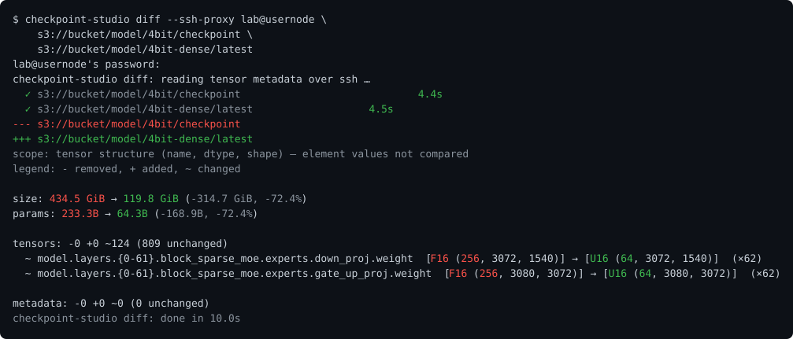

# Checkpoint Studio

A fast terminal UI for looking **inside** model checkpoints — not just the tree
of tensor names and shapes, but the **actual data**: heatmaps, grids of real
values, histograms, and exact statistics, computed right in your terminal on
tensors of *any* size. It reads [`safetensors`](https://huggingface.co/docs/safetensors),
[GGUF](https://huggingface.co/docs/hub/gguf), NumPy (`.npy` / `.npz`), and (opt-in)
HDF5 (`.h5` / `.hdf5`) checkpoints; decodes **quantized / packed weights** (4-bit,
fused-codebook MoE) so they show their true values; and ships scriptable
[`diff`](#comparing-checkpoints-diff) and [`check`](#checking-checkpoints-check)
subcommands for comparing and health-checking checkpoints.


## Highlights

- 🔬 **See the data, not just the shape.** From any tensor, open an ASCII
  [**heatmap**](#tensor-data-preview), a [**numeric grid**](#tensor-data-preview)
  of real values, a [**value histogram**](#value-histogram-h), and exact
  whole-tensor [**statistics**](#statistics) (min/max, mean, std, % zeros,
  NaN/Inf) — computed by streaming the tensor in bounded blocks, so it works on
  **multi-GB** tensors without loading them into RAM.
- 📊 **The whole checkpoint at a glance.** Press `s` for the full-screen
  [**stats view**](#checkpoint-statistics-s): total params / size, the largest /
  smallest / typical tensor, the dtype mix, and the per-layer and
  per-**MoE-expert** breakdown — experts split by projection (down / gate / up),
  and whether they're stored fused or unfused — plus **per-layer ASCII graphs**
  (size / params / tensor-count sparklines and an attention-vs-FFN composition
  chart). Header-only, so it's instant even on a many-shard model — plus the
  *true* on-disk footprint from the filesystem (`st_blocks`), so **ZFS/btrfs
  compression and sparse holes** show up, local or over SSH.
- 🧩 **Quantized weights, decoded.** [Reinterpret packed dtypes](#dtype-override)
  on the fly — 4-bit `u4`/`i4` nibbles, or fused-codebook **MoE experts**
  (`unpacked`, e.g. `u3×5`) — so quantized checkpoints show their true values and
  unmerged per-expert shapes instead of raw 16-bit blobs.
- 🗂️ **One tool, every format.** `safetensors`, GGUF, NumPy `.npy`/`.npz`, and
  (opt-in) Cerebras-style **HDF5** — read through a single interface, with
  sharded/multi-file models, directories, and glob patterns merged into one tree.
  (The data views above — heatmap/grid/histogram/stats — cover safetensors,
  NumPy, and HDF5; **GGUF is metadata-only**: its tree, quant types, and metadata.)
- 🔀 **`diff` two checkpoints — local or remote.** A scriptable
  [subcommand](#comparing-checkpoints-diff): structural diff by default
  (`diff`-style exit codes) with a coloured, readable summary — overall size and
  parameter-count change, per-tensor dtype/shape changes, and git-style line diffs
  for metadata — or add `--values`/`--histogram` with name/dtype/shape **filters**
  to compare only the tensors you care about, in parallel even across huge MoE
  checkpoints. Diffs **S3 / MinIO** and remote-SSH checkpoints too (`--ssh-proxy`),
  so you can compare two deployed checkpoints without downloading either.
- 🩺 **`check` a checkpoint's health.** A scriptable
  [subcommand](#checking-checkpoints-check) (`diff`-style exit codes) that flags
  **truncated / corrupt** safetensors files, **missing layers** or dropped
  shards, index/file mismatches, and dtype/shape oddities — all header-only, so it
  works over `--ssh-proxy` / S3 — plus a `--values` pass that scans tensor data for
  **NaN/±Inf** and all-zero/constant tensors.
- 🌐 **Built for big & remote.** Loads only metadata (fast startup on huge
  models), and **browses *and* diffs checkpoints on S3 / MinIO** — or any box you
  reach by SSH — whose credentials never leave the server, by delegating the read
  to a remote host (`--ssh-proxy`, or an scp-style `host:/path`; see
  [Remote checkpoints](#remote-checkpoints-over-ssh---ssh-proxy)). The remote
  access is **strictly read-only** — it can't create, modify, or delete anything
  on the host, so it's safe to point at production checkpoints. Copies to your
  local clipboard over SSH via **OSC 52**, and a `y` key prints the exact CLI
  command to reopen any view — shareable and scriptable.
- 🗜️ **HDF5 repacking.** Losslessly [re-compress](#repacking-hdf5-checkpoints---features-hdf5)
  LZ4 checkpoints with **zstd**/gzip for a smaller on-disk footprint.
- ✏️ **In-place tensor renaming.** [Rename tensors](#renaming-tensors-in-place-convert---map)
  in a safetensors checkpoint with regex rules (`convert --map`, or `r` in the
  TUI) — rewrites only the headers and the index, so the weight **data never
  moves**; the whole remapping is validated first.

Plus the essentials: 🔎 fuzzy search (`/`), 🔢 natural sort for layer numbers
(`layer.2` before `layer.10`), 📏 human-readable sizes (KiB/MiB/GiB), and full
⌨️ keyboard navigation with browser-style back/forward history.

## Installation

### Install
```bash
cargo install --git https://github.com/antont-cerebras/checkpoint-studio
```

### Prerequisites
- Rust 1.88 or later (the crate uses edition 2024 and let-chains)
- **Node 20+ only if you change the web UI** (`web/`). Building or installing
  `checkpoint-studio` itself needs no Node at all — `web/dist` is committed and
  embedded at compile time. See [Rebuilding the UI](#web-ui-web).

### Build from source
```bash
git clone https://github.com/antont-cerebras/checkpoint-studio
cd checkpoint-studio
cargo build --release
```

### HDF5 checkpoint support (optional)
Reading Cerebras-style HDF5 checkpoints is behind the `hdf5` feature, which is
off by default so the standard build stays pure-Rust with no system
dependencies. Enabling it bundles and statically links libhdf5 (requires a C
toolchain + `cmake`; the first build is slower):
```bash
cargo install --git <repo-url> --features hdf5
# or from source:
cargo build --release --features hdf5
```

## Usage

### Basic usage
```bash
# Explore a single safetensors file
checkpoint-studio model.safetensors

# Explore a GGUF file
checkpoint-studio model.gguf

# Or if building from source
cargo run -- model.safetensors
cargo run -- model.gguf
```

### Directory exploration
```bash
# Explore all safetensors and GGUF files in a directory
checkpoint-studio /path/to/model/directory

# Recursively search subdirectories
checkpoint-studio -r /path/to/models

# The tool automatically detects and uses model.safetensors.index.json if present
checkpoint-studio /path/to/huggingface/model
```

### Multi-file exploration
```bash
# Explore multiple files as a unified model
checkpoint-studio model-00001-of-00003.safetensors model-00002-of-00003.safetensors model-00003-of-00003.safetensors

# Mix safetensors and GGUF files
checkpoint-studio model.safetensors model.gguf

# Mix files and directories
checkpoint-studio model.safetensors /path/to/additional/models
```

### Glob pattern support
```bash
# Use wildcards to select multiple files
checkpoint-studio *.safetensors

# Match files with specific patterns
checkpoint-studio model-*.gguf

# Match numbered checkpoint files
checkpoint-studio checkpoint-[0-9]*.safetensors

# Combine multiple patterns
checkpoint-studio *.safetensors *.gguf

# Mix glob patterns with explicit paths
checkpoint-studio model.safetensors checkpoint-*.safetensors
```

### Web UI (`web`)
Prefer a browser? The `web` subcommand serves the same information as the TUI over
an HTTP server:

```bash
checkpoint-studio web /path/to/checkpoint          # serve on all interfaces, port 8080
checkpoint-studio web --port 9000 /path/to/ckpt    # pick a port
```

It binds all interfaces by default (`--host 0.0.0.0`) and prints the reachable URL
using this machine's hostname — e.g. `http://your-vm.example.com:8080/` — so you
can open it from another machine's browser with no tunnel. Pass `--host 127.0.0.1`
to restrict it to loopback.

The server (a dependency-light, blocking `tiny_http` server — no async runtime)
**supplies the data** as JSON; the **browser owns the view state** (which screen,
tree folding, selection, search). It reads the checkpoint once and serves the
tensor tree, tensor detail, file browser, byte-layout map, stats, and the health /
structural check — plus on-demand heatmaps, value histograms, sample/slice grids,
and whole-tensor statistics that scan tensor bytes only when you open them. Remote
checkpoints work too — `web --ssh-proxy HOST:VENV s3://…` serves a source read over SSH,
with the same restriction the terminal has: the structure, stats and health are all there,
while the data views (which need the bytes) report that the checkpoint is metadata-only.
The UI is a Svelte single-page app **embedded in the binary**, so a released
`checkpoint-studio` needs nothing extra to serve it.

> [!WARNING]
> **There is no access control.** The server has no authentication of any kind, and it
> binds `0.0.0.0` by default so it is reachable at your machine's hostname. Anyone who can
> reach the port can read the served checkpoint — and, through `/api/diff?against=PATH`,
> the structure of **any checkpoint path the serving user can read**. Pass
> `--host 127.0.0.1` to restrict it to your own machine. When the bind is not loopback,
> the startup banner says so in the terminal and the page carries a strip saying the same.

**Reverse parity — what the browser has that the terminal deliberately doesn't.** The
terminal now has the compact (family-folded) tree (`k` / `--compact`) and flat-list sorting
(`o` / `O` / `--sort`). It does **not** have a theme switch: recolouring is browser-idiomatic
presentation, the terminal already answers to its own colour scheme, and this is left as an
intentional medium difference rather than a gap.

**What the web UI deliberately does not do.** It is **read-only**: renaming tensors in
place and repacking an HDF5 codec are offered by the CLI (`convert`) and the TUI (`R` and
the palette's repack command) but have no web equivalent, because they rewrite checkpoint
files and the server accepts requests from anywhere it is reachable. Diffing is available
everywhere, but only its **structural** half — the value comparison (`diff --values`) and
repack verification (`diff --verify-repack`) stay on the CLI, where a scan that reads every
byte of both checkpoints has a progress bar, cancellation, and somewhere to report
per-tensor findings.

**Rebuilding the UI** — only needed when changing `web/`. Requires **Node 20**
(pinned in `web/.nvmrc` / `web/.node-version`; `engine-strict` makes npm enforce it,
and the `pre*` scripts refuse to run on an older Node):
```bash
cd web
nvm use          # or: fnm use
npm ci
npm run check    # svelte-check (types)
npm run lint     # eslint — type-aware, incl. Svelte templates
npm run build    # regenerates web/dist
npm run dup      # jscpd — copy-paste detection over the RUST sources (see below)
```
`web/dist` is **committed** and embedded at compile time, and CI rebuilds it on the
`.nvmrc` Node and fails if the result differs — so commit the regenerated `dist`
alongside your `web/src` change, built on Node 20. (Why 20: Node 16 is EOL and ESLint
10 won't run on it.) For development, `npm run dev` runs Vite with hot-reload and
proxies `/api` to a running `web` instance.

**Duplication** is a gate too. `npm run dup` (or `npx jscpd@5.0.12 --config .jscpd.json` from the
repo root — it needs only Node, not the web toolchain) runs token-based copy-paste detection
over `crates/core/src` and `src`, and fails if duplication rises above the `threshold` in
`.jscpd.json`. That number is the current measurement, not an aspiration: lower it when a
refactor earns it, and raising it needs a reason in the commit — the same rule the coverage
floor follows. Tests are excluded, because a test's job is to spell its case out.

**Adding a data source** is one `Source` impl in `src/source.rs` plus an arm in
`resolve` — nothing else. Features never match on a source kind: they ask
`crates/core/src/capability.rs`, which derives what is possible from the pair (format ×
location) plus how the source is reached:

| capability | needs |
| --- | --- |
| read tensor bytes | local today — a capability, not a synonym for "is local", so the Hub gaining `Range` reads is one row |
| modify in place | safetensors **and** local (the rename editor) |
| repack | HDF5 **and** local (writes a *new* file, so a different capability) |
| byte-layout map | safetensors over **any** transport — a Hub repo has one |
| browse the file tree | every location has a listing |
| per-object metadata | S3 only |
| codec info | HDF5 only |
| `reach` | `Direct`, or `ViaSshProxy` for a source whose credentials live elsewhere |

`Capabilities` is serializable and served on `/api/tree`, so the browser asks rather than
inferring from the source's shape, and each unavailability carries one shared sentence —
a Hub repo is told the weights aren't there, not to "copy the checkpoint down".

**The Python side** (the scripts that run on the ssh proxy, plus the `typings/` stubs that
let a type checker see them) is gated by three tools, all **version-pinned** in CI:

```bash
python3 -m venv ~/.venvs/ckpt-tools           # any interpreter; the tools ship wheels
~/.venvs/ckpt-tools/bin/pip install "ruff==0.16.0" "pyright==1.1.409" "ty==0.0.63" "numpy<2"
ruff check .                                   # config in pyproject.toml
pyright                                        # strict; config in pyrightconfig.json
ty check crates/core/src/python crates/core/tests/python gen_demo.py record_demo.py
python3 -m unittest discover -s crates/core/tests/python -t crates/core/tests/python
```

Ruff runs with `select = ["ALL"]` — every rule it ships, minus a list of opt-outs that each
carry their reason in `pyproject.toml`. That is why the versions are pinned: with the whole
rule set at deny, a new ruff release would otherwise add rules to a red build on a commit
that changed nothing. Upgrading is a deliberate commit where the new findings get triaged.

### Hugging Face Hub (`hf://owner/name`)
Explore a repo on the Hub without downloading it:

```bash
checkpoint-studio hf://moonshotai/Kimi-K3            # or paste the browser URL
checkpoint-studio https://huggingface.co/moonshotai/Kimi-K3#2-model-summary
checkpoint-studio hf://owner/name@refs/pr/3 --stats  # a branch, tag or commit
```

A safetensors file begins with an 8-byte header length and that many bytes of JSON
describing every tensor — name, dtype, shape, and its byte range. The Hub serves files with
HTTP `Range` support, so the whole structure of a multi-terabyte repo costs a couple of
small requests per shard. Kimi-K3 is 96 shards and 1.4 TiB on the Hub; its 497,220 tensors
come back from ~3 KB of header per shard, and the tree, the compact view, the statistics,
the health check and the byte-layout map all work from that. **No weights are fetched.**

Which means the data views (heatmap, values, histogram, whole-tensor statistics) are *not*
available — they read tensor bytes, the one thing this never downloads. Same restriction as
`--ssh-proxy`, reported the same way. `HF_TOKEN` (or `HUGGING_FACE_HUB_TOKEN`) is sent as a
bearer token, so gated and private repos work with the token you already have; `HF_ENDPOINT`
points at a mirror.

All three frontends take a Hub reference, including the web UI:

```bash
checkpoint-studio web hf://moonshotai/Kimi-K3 --host 127.0.0.1
```

### Remote checkpoints over SSH (`--ssh-proxy`)
Browse a checkpoint that lives only on a remote host — either behind credentials
you (rightly) don't want to copy to your laptop (a Cerebras **cstorch** checkpoint
on MinIO, brokered by a secrets manager), or simply on a box you reach by SSH.
`--ssh-proxy [USER@]HOST` delegates the read to that host and renders the tree
locally. It handles:
- a **directory of safetensors shards** (or a single `.safetensors` file) at a
  remote path — read over **pure-Rust SFTP** (the tool speaks SSH/SFTP itself, no
  external binary runs locally or on the server). It fetches just each shard's
  header (via the index's `weight_map` + the dir's `*.safetensors`) and parses it
  with the same safetensors parser used for local files. Shards are read **in
  parallel** over a small pool of SSH sessions (the entered password is reused, so
  still one prompt). Host keys are checked against `~/.ssh/known_hosts`; auth uses
  your SSH agent, default keys, or a password / keyboard-interactive prompt.
- an **`s3://…` cstorch checkpoint** — opened **lazily** by a small
  `cerebras.pytorch` script in the remote venv (`source ~/venv/bin/activate` by
  default; point elsewhere with `--ssh-venv /path/to/venv`). This is the one path
  that runs anything remotely (Python/cstorch, over `ssh`), since cstorch/akeyless
  access is the whole point of it.
```bash
checkpoint-studio --ssh-proxy you@host.example.com \
  /opt/models/some-model-4bit                                   # safetensors dir (SFTP)
checkpoint-studio --ssh-proxy you@host.example.com \
  s3://my-bucket/some-model/4bit/260504/checkpoint              # s3 cstorch
# scp-style shorthand for a remote safetensors dir (no --ssh-proxy needed):
checkpoint-studio host.example.com:/opt/models/some-model-4bit
```
**Nothing but the header metadata leaves the server** — no keys, no tensor data.

**Default proxy in a config file.** Typing `--ssh-proxy …` every time gets old, so
set the host you usually use in `~/.config/checkpoint-studio/config.toml` (or
`$XDG_CONFIG_HOME/checkpoint-studio/config.toml`):
```toml
ssh_proxy = "you@host.example.com"
ssh_venv  = "~/venv"   # optional — the cstorch venv on that host (default: ~/venv)
```
Then plain `checkpoint-studio s3://my-bucket/…/checkpoint` (or `diff`, `check`,
`web`) reads through that proxy with no flag. For a **remote filesystem path** (which
looks just like a local one), prefix it with `:` to route it there:
```bash
checkpoint-studio :/opt/models/some-model-4bit     # = --ssh-proxy <config host> /opt/models/…
```
The `:` is the explicit opt-in, so a same-named *local* directory is never silently
read off-host (and `:PATH` with no proxy configured is an error, not a local read).
An explicit `--ssh-proxy` / `--ssh-venv` on the command line always overrides the
config, and a missing or malformed config file is simply ignored. (`--ssh-read` still
works as an alias for `--ssh-proxy`, so older commands keep running.)

**Recording a remote transcript.** Set `CHECKPOINT_STUDIO_RECORD_REMOTE=<dir>` and the
stdout of each remote script is saved to `<dir>/{dump,value_diff,repack_verify,list_objects}.txt`.
Only what already crossed the ssh link is written — metadata and results, never tensor
data. Useful twice over: it's the fastest way to report a remote problem (send the
transcript rather than describe it), and the checked-in fixtures under
`crates/core/tests/fixtures/remote/` are recordings replayed through the parsers in tests,
so the protocol is pinned to what the cluster really emits rather than to what we assumed.

> **Read-only, guaranteed.** `--ssh-proxy` never modifies the remote checkpoint.
> Files are opened strictly read-only (`OpenFlags::READ` — no create/write/
> truncate), the tool issues no `mkdir`/`remove`/`rename`/`chmod`, and the `s3://`
> path only *loads* the checkpoint and prints metadata to stdout (no
> `save`/write). So it's safe to point at production checkpoints — it cannot
> accidentally alter or delete anything on the host.

This is **metadata-only** (structure + dtype + shape) — flagged by a
`metadata-only` badge on the tree's status line (beside the read-only / health
badges; hover it for the why). The data views (heatmap / numeric grid / histogram
/ statistics) need the bytes locally, so copy the checkpoint down to preview its
values. The **[file browser](#file-browser-tab)** (`Tab` / `--files`) *does* work
remotely — it reads only directory listings and safetensors headers (see there).
`diff` takes `--ssh-proxy` too, for a
structural (dtype/shape) comparison of two remote checkpoints:
```bash
checkpoint-studio diff --ssh-proxy lab@usernode /opt/…/model-a /opt/…/model-b
```
(The two checkpoints are read **in parallel** — any mix of `s3://` and safetensors
dirs — each with its own colour progress spinner and elapsed timer. The password
is entered once and reused for the second connection, so you're still prompted only
once.)

When **both** sides are `s3://`, the diff also compares the underlying **S3 objects'
metadata** — checksum / ETag, size, object tags, and user metadata — matched by
each object's prefix-relative key. This uses the remote host's own AWS access (the
same access that reads the checkpoint; nothing S3 happens locally), so no extra
local credentials are needed — though **tags** need the `s3:GetObjectTagging`
permission on that role, and if it's missing the diff notes it and carries on
(best-effort). **Timestamps are informational only**: a different last-modified — or
a timestamp-valued tag/metadata entry — is shown but never counts as a difference
(so it never flips the exit code). A **scope line** spells out exactly what was
checked and how much it's worth: ETag (flagged as a single-part MD5 content hash vs
a multipart composite that only matches when the part layout does), how many objects
carried a stored checksum / user metadata, and whether tags were compared — so
"N unchanged" is never ambiguous.

### Open a tensor directly
Jump straight to a tensor's preview on startup instead of navigating the tree —
handy for scripting or revisiting a known tensor:
```bash
# Open a tensor's detail screen
checkpoint-studio model.hdf5 --tensor model.layers.0.mlp.down_proj.weight

# Open straight into the numeric values grid, reinterpreted as packed 4-bit,
# in the first/last edges submode
checkpoint-studio model.hdf5 \
  --tensor model.layers.0.block_sparse_moe.experts.down_proj.weight \
  --dtype u4 --values --edge

# --tensor is optional when the checkpoint holds a single tensor (always so for
# a .npy): reshape a flat dump and view it as packed 4-bit, no name needed
checkpoint-studio weights.npy --shape 128,3088,2992 --dtype u4 --values
```
The flags below act on the opened tensor. `--tensor` names it (exact name), but
is **optional when the checkpoint has only one tensor** — always the case for a
`.npy`, and for a single-array `.npz`/HDF5/safetensors; with several, a view flag
without `--tensor` is reported as ambiguous.

| Flag | Effect |
|------|--------|
| `--tensor <NAME>` | Open this tensor (exact name); optional for single-tensor checkpoints |
| `--metadata <NAME>` | Reveal a metadata entry in the tree (exact name, e.g. `model.norm.weight.__metadata__`) |
| `--values` / `--heatmap` | Open the numeric grid / the heatmap (default: the detail screen) |
| `--histogram` | Show the value histogram on the detail screen |
| `--bins <N>` | Histogram bucket count (1–512); implies `--histogram` |
| `--tree` | Reveal the tensor highlighted in the tree browser, without opening a view |
| `--tree-state <expanded\|collapsed>` | Open the tree fully expanded / collapsed (the `E` / `C` keys) |
| `--search <QUERY>` | Open the tree in search mode filtered to QUERY (the `/` key) |
| `--legend` | Overlay the opened screen's legend (the `l` key); most useful with `--plain` |
| `--health` | Open straight into the health-check popup on the tree (the `h` key) |
| `--health-findings` | Like `--health`, but with the per-finding detail expanded (the popup's `f` toggle) |
| `--stats` | Open straight into the full-screen checkpoint-stats view (the `s` key) |
| `--stats-shards` | Like `--stats`, but with the on-disk per-shard breakdown expanded (the view's `f` toggle) |
| `--files` | Open straight into the [file browser](#file-browser-tab) — the checkpoint's directory tree (the `Tab` toggle) |
| `--layout <PATH>` | Open straight into the [safetensors layout map](#safetensors-layout-map) for `PATH` (`Enter` on a `.safetensors` in the file browser) |
| `--rename` | Open straight into the [rename editor](#renaming-tensors-in-place-convert---map) (local safetensors only; the `R` key) |
| `--rename-rule <SRC=>TGT>` | Seed a rule pair in the `--rename` editor (schema form, `{layer}`/`{expert}` placeholders kept); repeatable — what the editor's `y` records |
| `--dtype <DTYPE>` | Reinterpret the dtype: `u4`, `i4`, `unpacked` (fused-codebook unmerge; needs a packing schema), or `f16`/`bf16`/`i16`/`u16`/`f32`/`i32`/`u32`/`f64`/`i64`/`u64`/`i8`/`u8`/`stored` |
| `--shape <DIMS>` | Reinterpret the shape (same element count): `10,100` / `10x100`; one dim may be `-1`/`*`/`_` to infer |
| `--edge[=RFRAC,CFRAC]` (alias `--edges`) / `--overview` / `--window[=ROW,COL]` | Force the edges submode (optional head/tail split fractions `0..1`) / the overview / the contiguous window (optional top-left `ROW,COL`) |
| `--zebra <rows\|cols\|off>` | Zebra-stripe the numeric grid by rows, columns, or off |
| `--base <dec\|hex\|oct\|bin>` | Numeral base for the numeric grid; non-decimal shows each element's raw stored bits |
| `--slice <INDEX>` | Starting slice for a 3D tensor: an index (`12`) or a percentage (`50%`) |
| `--compute-stats` | Start the statistics scan immediately on the detail view (data views always compute them) |
| `--exit` | Render the requested view once and exit, without entering interactive navigation |

Dismissing the opened screen drops you into the normal tree browser, so you can
keep exploring.

### Export the tree or tensor list (scripting)
Print the checkpoint structure to stdout and exit — for piping into `grep` /
`jq` or saving to a file — instead of opening the browser. `--print-tree` dumps
the grouped tree (fully expanded, the same text the `t` key copies);
`--print-tensors` a flat list of every tensor. Both default to plain text and
accept `--format json`; add `-v` for per-tensor detail. Output is pipe-safe
(closing the pipe, e.g. `| head`, exits cleanly).

```bash
# The whole tree as text, fully expanded
checkpoint-studio model.safetensors --print-tree

# A flat, one-per-line list of every tensor (natural-sorted)
checkpoint-studio shards/ --print-tensors

# A model.safetensors.index.json-style object: metadata.total_size + a
# weight_map of tensor name -> shard file
checkpoint-studio shards/ --print-tree --format json

# -v adds detail: the source file in text; a `tensors` block (dtype/shape/
# element count, plus codec + on-disk size for compressed tensors) in JSON
checkpoint-studio model.safetensors --print-tensors --format json -v

# Works over SSH too — only the structure crosses the wire
checkpoint-studio host:/opt/model --print-tree --format json

# Filter by a name glob (repeatable); prefix ! to exclude
checkpoint-studio model.safetensors --print-tree --name '*.mlp.*'
checkpoint-studio model.safetensors --print-tensors --name '!*.bias'
```

| Flag | Effect |
|------|--------|
| `--print-tree` | Print the grouped tree (fully expanded) and exit |
| `--print-tensors` | Print a flat list of every tensor and exit |
| `--print-model` | Print the whole central checkpoint model (files + headers + config + index) as JSON and exit — the serializable datatype the app reads everything into |
| `--print-view` | Print the tensor-tree screen's `ViewModel` (visible rows, selection, search) as JSON and exit — the kernel's frontend-agnostic output contract a web/MCP frontend would serve |
| `--format <text\|json>` | Output format for the above (default `text`) |
| `-v` / `--verbose` | Add per-tensor detail (source file in text; a `tensors` block / detail objects — dtype, shape, element count, and codec + on-disk size for compressed tensors — in JSON) |
| `--name <GLOB>` | Restrict the printed tree/list to matching tensor names (repeatable; prefix `!` to exclude, e.g. `'!*.bias'` = everything but biases) |

### Keyboard Controls

Every shortcut shown in the footer is also a **clickable button** — click it to
run the action, or **hover it with the mouse to pop up a help bubble** explaining
what it does (handy while you're still learning the keys).

| Key | Action |
|-----|--------|
| `↑` / `↓` | Navigate up/down through the tree |
| `←` | Jump to the parent group |
| `→` | Enter the group (expand if needed) and select its first child |
| `Shift`+`↑` / `Shift`+`↓` | Jump to the previous / next sibling |
| `Enter` | Expand/collapse the group, or open the tensor's details |
| `Tab` | Toggle the **[file browser](#file-browser-tab)** — the checkpoint's directory tree; `Tab` again (or `Backspace`) returns to the tensor tree |
| `Space` / `:` | Open the **command palette** — fuzzy-search and run any command (VS Code style, grouped `Copy: File path`, `View: File browser`, …) |
| `E` / `C` | Expand all / collapse all groups |
| `/` | Enter search mode to filter tensors |
| `l` | Show a legend explaining the symbols on the current screen (works on every screen) |
| `c` | Copy the current screen's text to the clipboard (works on every screen; `^S` in the rename editor, where letters type into fields) |
| `t` | (Tree) open a menu to copy the tree or a flat tensor list — text or JSON, plain or verbose (every `--print-*` variant) — to the clipboard |
| `f` | Copy the selected row's File path (tensor file, or a group/root's file or directory) |
| `n` | Copy the selected tensor's Name to the clipboard |
| `y` | Show and copy the CLI command that reopens this exact screen — file, tensor (or metadata entry), dtype/shape overrides, view, layout, zebra, base, slice (works on every screen) |
| `s` | **Detail screen:** compute the tensor's statistics on demand · **Tree:** open the full-screen [checkpoint-stats view](#checkpoint-statistics-s) — per-file / per-tensor sizes, params, the dtype mix, the per-layer / per-expert breakdown, and per-layer graphs; `f` folds/unfolds the on-disk per-shard list, `r` copies the report, `c` the screen, `l` the legend, `y` the reopen command (`--stats`), `Esc` / `⌫` back |
| `h` | **Detail screen:** show the value histogram · **Tree:** run the health checks and float the report in a popup — `f` folds/unfolds the per-finding detail (folded by default), `v` runs the value-tier data scan (progress bar; `Esc` cancels), `r` copies the report, `c` the screen, `y` the reopen command (`--health`); same checks as the [`check`](#checking-checkpoints-check) subcommand (auto-suggested when an index/file mismatch is detected) |
| `r` | Repack the current HDF5 checkpoint into a new file (HDF5 only) |
| `R` | Open the [rename editor](#renaming-tensors-in-place-convert---map) (local safetensors only): a full-screen mode to rename tensors in place with autocomplete + a live before→after diff preview. Capital `R` — deliberately harder to hit than a plain letter, since it edits files in place |
| `Backspace` / `\` | Step **back** / **forward** through the screens you've visited (browser-style history) — e.g. reopen a view you just left |
| `Esc` | Exit search mode |
| `q` | Quit the application (or exit search mode if active) |
| `Ctrl+C` | Force quit |

`Backspace` and `\` move through a history of the screens you've been on (the
tree, a tensor's detail, and its data views), so if you leave a screen by a
stray key you can step right back to it — and forward again. (While the tree's
search box is active, `Backspace` edits the query instead.)

`c` copies the **text of the current screen** to the clipboard — the tree
listing, a tensor's detail, or a data view's grid — via the OSC 52 terminal
escape, so it reaches your local clipboard even over SSH/tmux (when the terminal
supports it). `t` (in the tree) opens a small menu to copy the **whole
checkpoint** rather than just the visible screen — pick the tree or a flat
tensor list, as text or JSON, plain or verbose (every `--print-*` variant; see
[Export the tree or tensor list](#export-the-tree-or-tensor-list-scripting)).
If the chosen export is too large for the terminal's clipboard, `t` instead
copies the exact CLI command that reproduces it and shows it, so you can run
that to export it.
A status bar pinned to the bottom of the tree shows the file the
selected tensor lives in (or, for a group/root, the single file or the shared
directory of its tensors); `f` copies that path (so copying the root yields the
file or the checkpoint directory).

`y` shows — and copies — the **CLI command that reopens the current screen** with
its precise settings: the file and `--tensor`, any active `--dtype` / `--shape`
override, the view (`--values` / `--heatmap`), the layout *and its position* (the
window's top-left corner via `--window=ROW,COL`, or the edges head/tail split via
`--edge=RFRAC,CFRAC`), the `--zebra` mode, the `--base`, and the `--slice`. So a
panned window or a re-balanced edges view round-trips exactly. On the tree it reproduces the
*highlighted tensor* — `--tensor … --tree`, which reopens the tree with that
tensor revealed (e.g. after backing out of its view) rather than opening it.
Paste it to share or revisit an exact view; append `--exit` to render it once
and drop back to the shell.

### Search Feature

Press `/` to enter search mode and start typing to filter tensors by name. The search:
- Uses **fuzzy matching** - find tensors even with typos or partial matches (e.g., "attnproj" will match "attn.c_proj.weight")
- Searches **all tensors** - not just visible ones, regardless of collapsed groups
- Shows results in a **flat list** with full tensor names
- Sorts by **relevance** - best matches appear first

Press `Enter` to open the highlighted result's details (you stay in search), and `Esc` or `q` to exit search mode and return to the full tree view.

### File browser (`Tab`)

Press `Tab` to swap the tensor tree for a **file browser** of the checkpoint's
directory — the shards alongside their sidecars (`config.json`, tokenizer files,
`README`, …), directories folding with `←` / `→`. `Tab` again (or `Backspace`)
returns to the tensor tree; launch straight into it with `--files`, or run
`View: File browser` from the command palette.

Every row says what the file *is*, not just how big it is:

```
File browser - Qwen3-Coder-30B-A3B-lut-3bit
────────────────────────────────────────────────────────────────────────────
▾ Qwen3-Coder-30B-A3B-lut-3bit/         57.6 GiB  29 files · 26 hardlinked
  · README.md                            5.3 KiB  ⧉ 2 names
  ▦ codebooks.safetensors               42.2 MiB  96 tensors · 7.2e-2% of params · ✚ not in the index
  ▦ model-00001-of-00016.safetensors     3.7 GiB ━━━━━━━━━━━━  1062 tensors · 6.5% of params · ⧉ 2 names
  ▦ model-00016-of-00016.safetensors     1.0 GiB ━━━╌╌╌╌╌╌╌╌╌  152 tensors · 1.8% of params · ⧉ 2 names
  ▦ qscales.safetensors                676.5 MiB ━━╌╌╌╌╌╌╌╌╌╌  12288 tensors · 1.1% of params · ✚ not in the index
```

- **sizes are a column**, right-aligned, so a listing reads down instead of
  trailing each name wherever it happens to end.
- the **bar** is each file against the *largest file here* — not against the
  directory total, which for a 57 GiB checkpoint would draw twenty identical
  slivers. Against the biggest, the shards fill it and the sidecars are visibly
  nothing, which is the true shape of a checkpoint. (Colour carries filled-vs-empty,
  so `--plain` shows the aligned column without the bar rather than the same twelve
  cells on every row.)
- **`N tensors · X% of params`** — what the model reads out of this file. Sixteen
  equal-sized shards are otherwise sixteen identical rows; the parameter share is
  what finds the odd file out, since a codebook or scale file is large on disk and
  tiny in parameters. Every shard's header is already parsed at open, so this costs
  nothing.
- **`✚ not in the index`** — a checkpoint file `model.safetensors.index.json`
  doesn't name. Not an error, and often expected (a LUT-quantized checkpoint ships
  codebooks and scales the index never mentions), but a loader that follows only the
  index will not read it. Same mark and colour the tensor tree uses for an extra
  tensor.
- **`⧉ N names`** — the file is hardlinked, so its bytes are shared: deleting this
  name frees nothing, and the sizes down the column add up to more than the
  checkpoint occupies. The directory row totals them (`29 files · 26 hardlinked`),
  which is the question a 57 GiB listing actually raises. A count, not a byte total:
  shared bytes aren't free, someone pays for them once.
- **`✗ unreadable`** — this file's header wouldn't parse; see below.

`Enter` acts on the selected entry:

- a **`.safetensors`** file opens its **[layout map](#safetensors-layout-map)** —
  a picture of how its tensors are stored inside the file (see below).
- another **checkpoint file** (`.gguf`, `.npy`, `.npz`, `.h5`) opens its tensor
  tree — the one you're exploring drops straight back to it; a *different*
  checkpoint shows the command to open it in its own view.
- a **JSON** sidecar opens a scrollable, syntax-highlighted preview; other
  **text** files (`.txt`, `.md`, `.py`, `README`, …) preview as plain scrollable
  text.

  **Markdown is a rendered document in the web UI only.** `checkpoint-studio web`
  renders a README or model card properly — headings, tables, clickable links,
  and syntax-highlighted code blocks — with the model's `---` frontmatter lifted
  out as a field list, and a *source* toggle for the highlighted raw file. The
  terminal has no equivalent library, and hand-writing one would just disagree
  with it, so the TUI shows markdown as plain text on purpose.

  A card comes from a checkpoint someone else built, so the rendered HTML is
  sanitized before it is shown: scripts, event handlers, `javascript:` URLs and
  `<style>` blocks don't survive, and links open in a new tab with `noopener`.
- anything else shows a short info pop-up (no preview).

`t` on a shard **narrows the tensor tree to that file's tensors** and goes there.
It is expressed as the filter query `shard:<name>`, which is the same state
`--filter` sets — so the title shows the query and the match count, the filter bar
can edit or clear it, and `y` reproduces it. Coming back the other way, entering
the browser lands on the file the tree's **selected tensor** lives in, so the two
views answer each other's questions.

The file view has the same command palette (`Space` / `:`), `l` legend, `c` /
`f` / `y` copies (screen / file path / command), and `y` round-trips through
`--files`, like the tree.

<a id="a-shard-that-wont-read"></a>

**A shard that won't read doesn't sink the checkpoint.** A truncated download or
an interrupted conversion leaves fifteen good shards and one bad one, and showing
the fifteen with the sixteenth named beats showing nothing: the readable shards
load, the tree holds their tensors, the bad file's row reads `✗ unreadable`, and
the [`check` report](#checking-checkpoints-check) names it with the parse error and
fails. This holds for a local directory, an `--ssh-proxy` one, and a Hub repo.
When *nothing* reads, the error is the answer — there is no checkpoint to show, and
"0 tensors" tells you less than why.

**Remote checkpoints too** (`--ssh-proxy`) — the browser adapts to the source,
reading only metadata (no tensor data leaves the host):

- a **remote safetensors directory** is browsed over SFTP just like a local one —
  the full directory tree, `Enter` on a shard opens its **layout map** (parsed
  from the header alone), and `Enter` on `config.json` / a text sidecar previews
  it (small read-only reads).
- an **`s3://…` cstorch checkpoint** is listed **s3-natively** — its objects by
  key with shared prefixes as folders and each object's size, via one boto3
  `list_objects_v2`. It's **browse-only**: `Enter` on an object shows its full key
  and size (cstorch objects aren't per-file safetensors, so there's no per-object
  layout or preview).

`y` round-trips the remote view too (`--ssh-proxy … --files`, and `--layout` for a
remote shard).

### safetensors layout map

Pressing `Enter` on a `.safetensors` file (or launching with `--layout PATH`, or
`Tab` from a tensor's detail screen) opens a **layout map** — a scrollable,
top-to-bottom picture of the file's byte layout, so you can *see* how a
safetensors file is built:

```
Layout - model-00001.safetensors
2.3 GiB · 291 tensors · header 42.0 KiB · 3 metadata · 2 gaps 8.0 KiB
BF16 1.8 GiB · F16 480.0 MiB · U8 24.0 MiB
────────────────────────────────────────────────────────────
0x00000000000a ┬ █  header (8 B length + JSON metadata)  42.0 KiB
               │ █  † format  pt
               │ ▓  model.embed_tokens.weight  BF16 (152064, 4096)  512.0 MiB
               │ ▒  model.layers.0.self_attn.q_proj.weight  BF16 (4096, 4096)  36.0 MiB
0x00002000a00a │ ░  model.layers.0.self_attn.k_proj.weight  BF16 (1024, 4096)  9.0 MiB
               ...
```

The file is `8` bytes of little-endian header length, then that many bytes of
JSON metadata (each tensor's dtype, shape and byte offsets), then the tensor
data laid out back-to-back. The map shows one band per region in file order —
the header first, then every tensor by offset — each band's **height
proportional to its share of the file** and its block shaded by size, with the
absolute byte offset on the left. The header band lists the file's
`__metadata__` entries tree-like.

**Bands are coloured by dtype family** — one colour per family rather than per
dtype name, because "is this shard half-precision weights or 8-bit quantized" is a
question about the family, and a dozen-entry palette stops being readable. Half
precision keeps the app's own amber, since that is what most published weights
are. The header line carries the **per-file dtype tally** with byte totals, so you
can see the file's composition without reading 291 rows, and any **unaccounted
gaps** (alignment padding) as a count and a total. `l` opens the legend, which
lists each family in its own colour with its share of the file.

Move the selection with `↑↓` / `PgUp`/`PgDn` (or click a band). `Enter` on the
header previews the raw JSON (with its 8-byte length; `c` copies it); on a tensor
it opens that tensor's **detail screen** — dtype, shape, values, statistics — which
is what `Enter` does on a tree row and what clicking a band does in the web UI.
Finding the tensor among its *siblings* is the other question a band raises, and
its underlined name still links to the tree for that. `y` copies the reopen command
including the selected tensor (`--layout … --layout-select <name>`); `Backspace`
(or `Tab`) returns to the browser (and back again lands on the same segment).

**Clickable names, everywhere.** Names are links across the app: a concrete
**tensor name** (underlined) jumps to it in the tree — the tensor bands here, and
the source tensor in the rename preview — and a **safetensors filename** opens its
layout map (a tensor detail screen's `File:` path, and each shard in the rename
preview). One click, straight to the right view.

### Tensor data preview

From a tensor's detail screen (open it with `Enter`), you can preview the
actual data of 1D/2D/3D tensors. Size-1 dimensions are ignored when counting
those, so a tensor stored as e.g. `(128, 3088, 1, 748)` previews as the 3D
`(128, 3088, 748)` it effectively is:

- `m` — an **ASCII heatmap**: each sampled element is a colored block on a
  blue→green→red scale, with a min/max legend. Each character row packs two
  data rows (upper/lower half-block) for higher vertical resolution.
- `v` — a **numeric grid** of sampled values with row/column indices, including
  the edges. Column width adapts to the *actual* values (from the exact stats),
  so a tensor of small numbers packs many more columns onto the screen — even a
  16-bit dtype whose values happen to be one- or two-digit (common for sparse /
  quantized formats) gets as many columns as a 4-bit view, instead of always
  reserving room for `-32768`. Floats use a fixed scientific-notation width.
  When an index label is wider than its (narrow) cell, the labels are staggered
  across two header rows ("leap-frog"), and — for the most extreme cases —
  thinned so the ones shown don't collide. To make the grid easier on the eyes
  the indices are dimmed and the cells get a subtle alternating "zebra"
  background (a constant-width band per row or column); `z` cycles the striping
  between rows, columns, and off. `b` cycles the **numeral base** — decimal
  (the default), hex, octal, or binary; the non-decimal bases print each
  element's raw stored bit pattern, zero-padded to the dtype's width (e.g. an
  `F32` as 8 hex digits, a `BF16` as 4), which is handy for inspecting exact
  bits, NaN/inf patterns, or quantized payloads.

Both views open in the **edges view** by default — the first *and* last rows and
columns (as many as fit), with a dotted `⋯` / `⋮` separator marking the skipped
middle — handy for seeing how a tensor is padded at its edges (e.g. zero padding
vs. something else). Press `e` to cycle the layout: **overview** (evenly-spaced)
→ **edges** → **window** → back to overview.
In the edges view the **arrow keys move the divider** between the first
and last blocks: `←` / `→` slide the column divider (so `→` grows the first
columns and shrinks the last, `←` the reverse), `↑` / `↓` slide the row divider,
and holding `Shift` pushes it all the way to one end (e.g. `Shift`+`←` to see
only the last columns). The header shows the current split (e.g.
`first 8 & last 18`). The layout choice and the split are remembered for the
session, so they stick as you move between tensors.

The **window** layout shows a contiguous block of the *actual* neighbouring
values (no downsampling) that you pan around with the **arrow keys**: a plain
arrow moves one row/column and `Shift`+arrow strides a whole screenful. To jump
straight to an edge, `Home` / `End` go to the first / last column and `PageUp` /
`PageDown` to the first / last row (`Ctrl`+arrow does the same on terminals that
send it). The header shows the visible range (e.g. `window: rows 120–179 of
3088`). The pan position is remembered for the session and clamped to stay in
bounds.

For **3D tensors** (e.g. stacked MoE experts, shape `[experts, rows, cols]`) the
preview shows a 2D matrix at a fixed leading index — the 0th by default. The
`←` / `→` arrows step through the slices one at a time and `Shift`+`←` / `→` jump
~5% at a time (both wrap around at the ends); `/` prompts for a slice to jump to —
either an exact index or a percentage like `50%` (0% = first, 100% = last).
Out-of-range entries are rejected with a message rather than jumping. (In the
edges and window layouts the arrows are claimed by the divider / panning, so
there slices step with `[` / `]` — `/` still works.)
Within either view, `m` and `v` switch between the heatmap and numeric
representations in place, `e` cycles the layout (overview → edges → window), and
`Ctrl+C` quits the app from anywhere.

#### Value histogram (`h`)

On the **detail screen**, `h` computes a whole-tensor **value histogram** and
shows it inline below the statistics — a horizontal ASCII bar chart, one bar per
bin, each with its absolute count and percentage of the finite values. The bars
fill in live as the tensor is scanned (any key cancels). Small-integer encodings
get one bar per possible value — e.g. a `u4` view shows all 16 values `0..15`,
including ones absent from the data. Integers with a wider range are grouped into
whole-number-width bins (the bucket edges stay integers, never fractional), and
floats use equal-width range bins across the value range. It respects the active
`--dtype` reinterpretation, so a `u4` view histograms the unpacked 4-bit values.

Press `b` (or pass `--bins N`, 1–512) to set the bucket count — it applies to the
float and wide-integer cases (the small-integer encodings are intrinsically one
bar per value); an empty entry returns to the automatic count. Results are
cached, and `y` includes `--histogram` (and `--bins N` when set) so the view
round-trips.

#### Statistics

The heatmap/numeric views show **exact whole-tensor statistics** — value range,
mean, standard deviation, % zeros (sparsity) and a non-finite (NaN/Inf) count —
computed by scanning every element once (`safetensors` are memory-mapped and
decoded in parallel with `rayon`; HDF5 datasets are streamed in row-blocks so
memory stays bounded regardless of tensor size — including LZ4-compressed
Cerebras checkpoints, which are decompressed in-process). The heatmap's color
scale uses the exact range, so colors mean the same thing across slices. The
detail screen shows the same stats on demand: press `s` to compute them (so
browsing the tree stays fast). Results are cached per tensor (and per dtype
override) for the session, and the scan time is shown dimmed next to the stats.
Scanning a multi-GB tensor takes a moment the first time (it's largely
disk/NFS-bound); the scan runs on a worker thread with an animated spinner, a
progress bar (the fraction scanned so far) and a running timer. In the
heatmap/numeric views the scan stays **out of your way** —
you can keep switching the layout (overview / edges / window), panning, stepping
slices, and reinterpreting the dtype while it computes; the values are shown from
the sampled range until the exact stats land. Switching the dtype restarts the
scan for the new view. Leaving the view cancels it. (On the detail screen, where
there's nothing else to do, any key cancels the scan; `Ctrl+C` always quits.)

**Preloading.** Opening a tensor's detail screen starts computing its statistics
in the background, shown live on the *Statistics* line with a spinner, a progress
bar and a timer (instead of waiting for you to press `s`). The scan streams the tensor in bounded
blocks — never holding more than one block, so memory stays flat even for a
multi-gigabyte tensor — and reading every block warms the OS/disk cache (the
dominant cost over NFS) as a side effect. So by the time you open the
heatmap/numeric view the stats are ready and the data is already warm, and only
the small result is kept. The scan is cancelled the moment you leave the detail
screen, so it never competes with the interactive view, and whatever it read
stays warm in the cache. Disable it with `--no-preload` (then statistics are
computed only when you press `s`).

Both views also sample a grid that fits the screen (they never read the whole
tensor for the *display* — only each sampled row's column span). Both the
statistics and the data preview work for `safetensors`, NumPy (`.npy` / `.npz`),
and HDF5 (`--features hdf5`) of any size, reached through one format-agnostic
reader; GGUF data preview is not yet supported.

NumPy `.npy` files hold a single array (named after the file); `.npz` archives
expose each member array by name, and compressed archives
(`np.savez_compressed`) are decompressed on demand. Fortran-ordered arrays are
read correctly but shown transposed (their dimensions reversed).

#### Checkpoint statistics (`s`)

The per-tensor stats above answer "what's *in* this tensor?"; press `s` on the
**tree** for the complementary question — "what *is* this checkpoint?" — as a
full-screen view summarising the whole model at a glance (it scrolls with
↑/↓ · PgUp/PgDn · Home/End; `l` shows the legend, `Esc` / `⌫` steps back):

- **Overview** — the architecture (`model_type` from `config.json`, when
  present), total parameters, and total size (on-disk vs. logical, with the
  compression ratio for compressed HDF5).
- **Files** — how many shards, and the largest / smallest / average / median
  shard size, so an unbalanced split stands out.
- **Tensors** — the tensor count, plus the largest and smallest tensor (named)
  and the average / median size, so an outlier stands out.
- **Layers** — the repeated `…layers.<i>.…` stack: how many layers, and the
  parameters / bytes in each (and in total).
- **Experts (MoE)** — for mixture-of-experts checkpoints: experts per layer,
  whether they're stored **fused** (stacked into one tensor per projection) or
  **unfused** (a tensor per expert) — and whether gate & up are fused — plus the
  parameters / bytes in a single expert, and a **per-projection split** (down /
  gate / up, or the fused gate-up) with each projection's per-layer and total size.
- **Per-layer profile** — ASCII graphs across the transformer stack: min-anchored
  **sparklines** of size / parameters / tensor-count per layer (so an outlier or a
  dense-then-MoE split stands out at a glance), and a stacked **composition chart**
  splitting each layer into attention vs FFN/experts vs other. Long stacks are
  bucketed to fit; the glyphs are distinct (not colour-only) so the copied report
  reads the same in a plain terminal.
- **By dtype** — the dtype mix, each with its tensor count and byte share, so a
  quantized / mixed-precision checkpoint shows exactly how much is in each type.
- **On disk (filesystem)** — the *true* footprint from the OS (`st_blocks`),
  overall and per shard. Unlike every count above (which is logical: shape ×
  dtype), this reflects **filesystem compression (ZFS/btrfs) and sparse-file
  holes** — so a mostly-zero checkpoint that squashes on ZFS shows its real disk
  usage. The per-shard list is **folded by default** to a one-line summary
  (`N of M smaller`); press `f`, or click the row, to expand it to **every**
  shard's apparent → allocated size. For `--ssh-proxy` dirs it's measured by a single
  read-only `stat -L` on the remote host (SFTP carries no block count) — the same
  symlink-following size resolution the file browser uses, so a symlinked shard
  shows its real target footprint, not the link stub. It's omitted for `s3://` and
  in the deterministic `--plain` render (a live measurement isn't reproducible).
- **☁ S3 objects** — for an `s3://` cstorch source (`--ssh-proxy`), the underlying
  object store's metadata: object count and total size, **stored-checksum coverage**
  by algorithm (e.g. `126 with SHA256`, or "none stored" when equality would rest on
  the ETag), how many objects reported an **ETag**, **tag** coverage (or
  "unavailable (permission)" when `s3:GetObjectTagging` is denied), the
  **last-modified** span, and any user (`x-amz-meta-*`) metadata. The per-object list
  (each object's size + full ETag / checksum) is **folded by default**; press
  `f`, or click the row, to expand it. Fetched read-only over SSH with the tensor
  metadata (a `HEAD` per object), so it needs no local AWS credentials. This
  replaces the on-disk section for an s3 source (there's no local filesystem).

It's derived from the metadata already in memory (shapes and dtypes, no data
read), so it's instant even on a multi-GB, multi-shard checkpoint. The body
scrolls (`↑`/`↓`, `PgUp`/`PgDn`, `Home`/`End`, wheel) when it's taller than the
popup; `f` folds/unfolds the per-shard (or S3 per-object) list, `r` copies the
report as plain text, `c` copies the screen, `y` copies the command that reopens
it (`--stats`, or `--stats-shards` when the list is expanded), and `Esc` or a
click dismisses.

#### Dtype override

When the stored dtype misrepresents the data — common for quantized checkpoints
where 4-bit weights are packed into a `bf16`/`f16`/`i16` slot — press `d`
(safetensors or HDF5) to open a menu of alternative interpretations, just for
visualization. It reinterprets the raw stored bytes, so for HDF5 it applies to
both the statistics and (for previewable sizes) the data views.
This works from both the tensor **detail** screen and the heatmap/numeric views;
the detail screen updates its dtype, shape and parameter count to match. The menu
previews each option live as you move through it (`←`/`→` or `d`/`D` to move,
`Enter` to apply, `Esc` to cancel); the choice is remembered per tensor until you
quit. Options for a 16-bit tensor:

- another **same-width** dtype, e.g. view a `BF16` tensor as `F16` / `I16` / `U16`;
- **`u4`/`i4`** — quantized 4-bit weights stored inside a wider container, with
  every nibble unpacked densely, so each 16-bit slot yields four values and the
  last dimension grows ×4 (`i4` sign-extends two's-complement nibbles).
- **`unpacked`** — a fused-MoE codebook weight whose `U16` words pack several
  experts' sub-byte indices, described by a per-tensor **quantization schema**
  (`bit_widths`, e.g. `[4,4,4,4]` or `[3,3,3,3,3]`, even non-uniform). The view
  *unmerges* the schema along the **first (expert) dimension** — each logical
  expert is one field shifted out of the word — so the expert count grows by
  `lenP` (e.g. `(26, 2057, 770)` → `(130, 2057, 770)` for `u3×5`) and each expert
  reads as a correct 2D slice. Stepping the slice (`[`/`]`, `←`/`→`) walks the
  experts. This option appears, and is applied by default, only for tensors that
  carry a schema (read from the per-tensor `…__metadata__` or a top-level
  `codebook_packing_schema`); `d` / `--dtype stored` switches back to the raw `U16`.

The header shows the active reinterpretation (e.g. `BF16 as u4`, or
`U16 as u3×5 (unpacked)` with a `Packing:` line listing the bit widths).

#### Shape override

Press `r` (or `--shape`) to **reinterpret the dimensions** — handy for a flat
array dumped without structure, or to fold a tensor into a more readable grid.
Enter dimensions separated by `,`, space, or `x` (e.g. `10, 100` / `10x100`);
the product must equal the tensor's element count, and one dimension may be a
wildcard (`-1`, `*`, or `_`) that's inferred from the rest, like NumPy's
`reshape(-1, …)`. An empty entry clears the override. The data isn't moved — any
reshape with a matching element count is a valid row-major reinterpretation — and
it composes with the dtype override (which then expands the new last dimension).
The header shows it against the stored shape, e.g. `(1182629888) as (128, 3088, 748)`.

### Repacking HDF5 checkpoints (`--features hdf5`)

Cerebras-style HDF5 checkpoints compress their chunks with LZ4, which — being
byte-oriented with no entropy coding — only reaches ~2× on quantized weights
(e.g. 4-bit values packed into 16-bit words). **Repacking** rewrites the file
with an entropy-coding codec, recovering that win, with the data preserved
exactly (same dtype, shape and chunking).

You choose the **codec** and the streaming **buffer size**:

- `gzip` (DEFLATE) — built in; ~3.5× on 4-bit weights, but slower.
- `zstd` — best ratio with fast decode (registered in-process; the output is
  also readable by `h5py` + `hdf5plugin`).
- `lz4` — the format these checkpoints ship with: fast, but only ~2×.
- `none` — store uncompressed.

From the main tree screen press `R`: it asks for the output filename (pre-filled
with `<name>.repacked.hdf5`), then the codec, then the buffer size, and shows a
progress bar while it streams each dataset across.

The same is available non-interactively:

```bash
# Repack with zstd (default level), 256 MiB streaming buffer
checkpoint-studio convert --codec zstd model.hdf5 model.zst.hdf5

# Pick a level (gzip 0–9, zstd 1–22), a 1 GiB buffer, and allow overwriting
checkpoint-studio convert -c gzip -l 9 -b 1G -f model.hdf5 model.gz.hdf5
```

Datasets are streamed in bounded row-blocks sized to the buffer, so memory stays
low regardless of tensor size (a larger buffer just means fewer, bigger reads).
On completion it reports how the on-disk size changed — e.g.
`39 datasets · on disk 8.2 GiB (lz4) → 5.3 GiB (zstd): 35% smaller (1.56×)`. It
refuses to write over its own input, and warns if the chosen codec is the one
the source already uses (a re-encode, where a plain copy would do).

### Renaming tensors in place (`convert --map`)

Sometimes a safetensors checkpoint just needs its tensors *renamed* — to match
another naming scheme, drop a `model.` prefix, and so on — without touching the
weights. `convert --map` does exactly that, **truly in place**: it rewrites only
each shard's JSON header (padding it back to its original length, so the tensor
**data never moves**) and updates `model.safetensors.index.json` to match. No new
file is written, and nothing is copied.

Rules use the **same `PATTERN=>REPLACEMENT` regex syntax as [`diff --map`](#comparing-checkpoints-diff)**
(repeatable, applied in order; `--map-from FILE` loads a plain-text or JSON rule
list). The scope is **local checkpoints only** — a directory of shards, or a
single `.safetensors` file.

```bash
# Drop the "model.layers." prefix across every shard, in place
checkpoint-studio convert ./my-checkpoint --map 'model\.layers\.=>layers.'

# Two rules, apply without the confirmation prompt
checkpoint-studio convert model.safetensors \
  --map 'self_attn=>attn' --map 'mlp=>feed_forward' --force
```

Because it never moves data, the whole remapping is **validated up front** and
refused (with nothing changed) if it isn't safe:

- **every rename target must fit in the existing header** — the new names are
  padded, not grown, so a rename to *longer* names that would overflow the header
  is rejected, naming the offending shard and by how many bytes it's over;
- **no collisions** — two tensors may not be renamed onto one name;
- **no invalid targets** — empty, or the reserved `__metadata__`;
- a rule that **matches nothing** is warned about; a rule set that renames
  nothing is refused.

It's a destructive, one-way edit, so it **asks for confirmation** first (showing
the full list of renames and the in-place caveat); `--force` skips the prompt,
and on a non-interactive terminal it refuses unless `--force` is given. The same
validity checks back [`diff --map`](#comparing-checkpoints-diff) too (there they
only *warn*, since `diff` never writes).

From the main tree screen, press **`R`** (capital — it edits files in place, so
it's deliberately harder to hit) or use the command palette → *File: Rename tensors
in place…* to open the **rename editor** — a full-screen mode (like the tensor
detail view), no regex required:

- **Rule pairs + autocomplete.** Each rule is a **source** field and a **new-name**
  field. As you type in either (matching is number-agnostic), a **completion
  dropdown** pops up under the field — pgcli-style — listing the matching tensor
  **schemas**, each with a `×N` count of how many tensors it covers. Move the
  highlight with **`↑`/`↓`** and accept with **`Enter`** (or click a row); **`Tab`**
  extends the field to the candidates' longest common prefix (shell-style — fill in
  as much as is unambiguous, then narrow further); **`Esc`** closes the dropdown.
  Accepting turns each layer / expert index
  into a `{layer}` / `{expert}` / `{n0}` **placeholder** (and prefills the new name
  from the source). Keep the placeholders and one rule renames the tensor across
  **every** layer and expert at once; type a **concrete** number instead (e.g.
  `…layers.0.…`) and it renames only that one.
- **Editing.** With the dropdown **closed**, `↑`/`↓` (and **`Enter`**) move between
  fields — `Enter` / `↓` past the last field adds a new rule pair; `←`/`→`/Home/End
  move the caret; `^N` adds a rule, `^D` removes the focused one. Backspacing a rule
  until **both** its fields are empty **removes it automatically** (focus jumps to the
  previous rule, or the next when it was the first) — so you can build up and prune
  several renames without reaching for `^D`. `Enter` never applies.
- **Live before→after preview.** A pane updates as you type with a **per-rule**
  summary: the schema `from → to`, how many tensors it touches, and whether they
  can be applied in place — `⚠ N won't fit in place` (the new names are longer than
  the header's fixed region) or `⚠ N collide` (two tensors onto one). A won't-fit
  rule lists **each shard's header sizing** (`header <current> B → <needed> B`, and
  the bytes over / to spare) so you can see exactly which file overflows — and each
  shard name is **clickable** (opens that file's [layout view](#safetensors-layout-map)).
  Compact — one block per rule — so it stays readable even when a rule matches every
  layer. Apply stays disabled until every rule is clean.
- **Apply command.** The equivalent `convert --map …` command that would apply the
  rename non-interactively is shown at the bottom (labelled `apply:`) and copied to
  the clipboard with **`^A`**.
- **Command palette + copies.** Like every other view, the editor has a command
  palette — press **`Space`** or **`:`** (a tensor-name schema never contains
  either, so they're free to use). Because bare letters type into the name fields,
  the editor's commands are **Ctrl keys** — the same commands as the non-editing
  modes' bare letters, Ctrl-prefixed so every character stays typeable, and each a
  real, clickable footer button with its key shown: `^R` apply, `^N`/`^D` add /
  remove a rule, `^L` legend, `^S` copy screen, `^Y` copy the command to reopen this
  view (the `y` of the other views), `^A` copy the apply command. Every command is
  reachable both by its key and from the palette — none are palette-only.

Press **`^R`** to apply (a Ctrl key, so every character stays typeable). A
**confirmation pop-up** floats over the editor with a summary of what will change (and
the in-place caveat); `Enter` on *Apply* — or `Y` — confirms and rewrites the headers,
then the tree reloads with the new names; `Esc` / `N` cancels. `^R` is disabled (with a
hint) until the preview is all-clear. `Esc` backs out of the editor; `^C` quits. (The
editor builds regex `--map` rules under the hood — the CLI is still there for scripted /
multi-rule remappings.)

Like the other views, the editor is **reproducible from the CLI**: `--rename` opens
it straight away, and each repeatable `--rename-rule 'SOURCE=>NEW-NAME'` seeds a rule
pair (schema form, `{layer}`/`{expert}` placeholders kept literally). That's exactly
what the palette's *Copy: Command to reopen this view* records, so an editor session
round-trips through `y`:

```bash
# Open the rename editor with one rule pre-filled (renames every layer's q_proj)
checkpoint-studio ./my-checkpoint --rename \
  --rename-rule 'model.layers.{layer}.attn.q_proj.weight=>model.layers.{layer}.self_attn.q_proj.weight'
```

### Comparing checkpoints (`diff`)

```bash
# Structural diff: which tensors (name/dtype/shape) and metadata were added,
# removed, or changed. Fast — tensor data is not read. Exit 0 = identical,
# 1 = differences, 2 = trouble (like the `diff` utility).
checkpoint-studio diff old.safetensors new.safetensors

# Also compare element values (not just dtype/shape): promotes a values-only
# change to a difference and reports max/mean |Δ|. Reads the data.
checkpoint-studio diff old.safetensors new.safetensors --values
```

**Scoping a side to a subtree (`#SUBTREE`).** When two checkpoints hold the same
weights under different top-level namespaces — e.g. an HF export nests everything
under `language_model.` (`language_model.model.layers.…`) while a converted
checkpoint has it at the root (`model.layers.…`) — append `#SUBTREE` to a source to
**descend into that subtree** and compare from there, so the names line up:
```bash
checkpoint-studio diff ':/opt/models/hf#language_model' s3://bkt/converted
#                                      └── compares the HF model's language_model.*
#                                          (as model.layers.*) vs the other side's root
```
It's a **scope change**, not a rename: the comparison starts N levels down, sibling
subtrees (`vision_tower`, `mm_projector`, …) fall outside it, and the totals + header
reflect the subtree. It applies to **either or both** operands. A local `--values` /
`--histogram` comparison is scoped the same way (data is read by byte offset, so the
tensors keep their real names); over `--ssh-proxy` the value comparison runs on the
remote *by name*, so there it's structural only. Split is on the last `#`, so a `#`
inside a path/key is preserved.

A remote structural diff of two `s3://` cstorch checkpoints — read over a single
SSH session (one password prompt), rendered in colour (old **red**, new **green**,
secondary detail dimmed):



**Comparing a subset of tensors.** Any of the filters below scopes the whole
diff (structural *and* `--values`/`--histogram`) to the matching tensors, so you
only read and compare what you care about. They **compose with AND** — a tensor
is kept only if it matches every filter given — and metadata isn't compared in a
filtered run (a note says so). Names, dtypes, and shapes all use the same glob
engine (`*`, `**`, `?`, `[…]`):

| Flag | Selects |
|------|---------|
| `--name <GLOB>` | Tensors whose name matches the glob, e.g. `'*.mlp.down_proj.weight'`, `'model.layers.*'`. Repeatable — matches ANY given; prefix `!` to exclude (`'!*.bias'` = everything but biases). |
| `--names <A,B,C>` | Exact names (comma-separated). |
| `--names-from <FILE>` | Exact names from a file (one per line; `#` comments allowed). |
| `--dtype-is <GLOB>` | Tensors whose stored dtype matches, e.g. `BF16`, `'F*'` (F16/F32/…). Case-insensitive; matches either side, so it catches a dtype change. |
| `--shape-is <DIMS>` | Tensors whose shape matches. Dims are comma- or `x`-separated; `*` wildcards **one** dimension and `**` **any number** — e.g. `768,2048`, `768,*`, `*,2048`, `768,**`, `**,2048`. |

```bash
# Value-compare just the down_proj weights across every layer
checkpoint-studio diff old/ new/ --values --name '*.down_proj.weight'

# Only the BF16 tensors whose shape ends in 2048
checkpoint-studio diff old/ new/ --dtype-is BF16 --shape-is '**,2048'

# A specific set of tensors listed in a file
checkpoint-studio diff old/ new/ --values --names-from tensors.txt
```

With a filter active, a line on **stderr** reports how many tensors matched (of
the total) and the matched names collapsed into their index-templated schema, so
it's clear which layers / experts were covered:

```
filter [name~*_proj.weight] matched 18624 of 31251 tensor(s):
    model.layers.{0-47}.mlp.experts.{0-127}.down_proj.weight  (×6144)
    ...
```

**Reconciling different naming schemes (`--map`).** When two checkpoints are the
same model under **different tensor names** — a common case across export
pipelines — a plain diff is a useless wall of "everything removed + everything
added". A rename rule rewrites the **old** (left) checkpoint's names into the
new one's scheme *before* comparing, so corresponding tensors line up and you see
the real deltas (dtype / shape / count) instead. Each rule is a regex →
replacement (`REGEX=>REPLACEMENT`, `$1` for captures), applied in order — so one
rule can rewrite a shared segment across every layer at once:

```bash
# gpt-oss (mlp.experts) vs a block_sparse_moe-named checkpoint
checkpoint-studio diff old/ new/ \
  --map '\.mlp\.experts\.=>.block_sparse_moe.experts.' \
  --map 'experts\.(down|gate_up)_proj$=>experts.${1}_proj.weight'

# Or load the rules from a file (merged after any --map). A '.json' file is a
# JSON array of [pattern, replacement] pairs; any other extension is one
# 'REGEX=>REPLACEMENT' rule per line ('#' comments and blank lines ignored).
checkpoint-studio diff old/ new/ --map-from rename.txt
```

A note on **stderr** reports how many rules were applied; if a rule is broad
enough to map two tensors onto one name, that collision is warned about (the last
wins). `--map` is a whole-checkpoint concern, so it's ignored with `--tensor`.

Value comparison (`--values` / `--histogram`) reads each tensor's data, so it
runs **in parallel** — `--jobs N` sets how many tensors are compared at once
(default: number of logical CPUs; `-j 1` = sequential). In a terminal a spinner
lists the tensors currently being compared; the total elapsed time is printed
when it finishes. All progress goes to stderr, so a piped diff on stdout stays
clean.

**How remote value comparison works (over `--ssh-proxy`).** For an s3-vs-s3
`--values` / `--histogram` / `--tensor` run, the tensor data isn't reachable from
your machine — so the comparison is done **entirely on the proxy**, by a read-only
`cerebras.pytorch` (cstorch) script on the host that holds the S3 access. For each
compared tensor the proxy streams both sides' S3 objects itself (chunked, straight
from S3 — much faster than letting cstorch materialize them), decodes them with
torch, and computes the differing count, max/mean **|Δ|**, and histogram distance
**there**. Only the small per-tensor *results* come back over SSH — **never tensor
data**. Each tensor gets its own live download bar (size + bytes read, then a
`comparing…` phase while the proxy decodes and compares); reads run `--jobs`-wide in
parallel. A final line reports the bytes read and throughput.

**`--verify-repack`** proves two `s3://` checkpoints hold the *same* quantized
expert weights in different index packings (**sparse**: one N-bit index per 16-bit
word ↔ **dense**: several indices folded into each word). On the proxy it decodes
and compares the packed indices, validates the packing (the unused high bits must
be zero), reports how many indices differ and by how much (an all-±1 difference is
the signature of an independent re-quantization, not a lossless repack), and diffs
the sibling **`codebook` / `qscale`** tensors — which share a shape on both sides
and so never show up in a structural diff, yet a codebook change explains index
drift. `--values` on a quantized expert weight (one with a sibling `.codebook`)
auto-detects the packing and compares it as indices the same way. Scope it with
`--name` — it reads the full tensors, so it's for a few layers at a time.

Related flags: `--tensor <NAME>` focuses one tensor (with a bin-by-bin
`--histogram` table); `--histogram` compares value *distributions* (total
variation distance); `--dtype <VIEW>` decodes under a view (e.g. `u4`,
`unpacked`) before comparing; `--only-tensors` skips metadata; `--full` lists
every entry instead of collapsing per-layer runs; `--no-color` disables colour.

### Checking checkpoints (`check`)

Run health checks on a checkpoint and report anything wrong. Exit status follows
`diff`: **`0`** healthy, **`1`** problems found, **`2`** trouble (a path couldn't
be read) — so it drops straight into CI or a pre-flight script.

```bash
# Structural checks (header-only, fast)
checkpoint-studio check /path/to/model/

# Also scan tensor data for NaN/±Inf and all-zero / constant tensors
checkpoint-studio check model.safetensors --values

# Machine-readable report for scripts / agents / CI
checkpoint-studio check /path/to/model/ --format json

# SARIF 2.1.0 — upload to GitHub code scanning / feed static-analysis tooling
checkpoint-studio check /path/to/model/ --format sarif > checkpoint.sarif

# A remote / S3 checkpoint (structural checks only — data stays on the host)
checkpoint-studio check --ssh-proxy lab@usernode s3://bucket/model/checkpoint
```

The **structural** checks read only headers, so they're cheap and work over
`--ssh-proxy` / `s3://` too:

- **Byte-range integrity** — safetensors tensor spans are sized correctly for
  their dtype/shape, packed contiguously from offset 0 with no gaps or overlaps,
  and the file is neither **truncated** (a classic interrupted download) nor
  padded with trailing data.
- **Header consistency** — the invariants a safetensors *header* carries beyond
  its byte spans:
  - the **data blob starts on an 8-byte boundary**. The reference serializer pads
    the JSON header with spaces to make it so. Nothing breaks without it, which is
    why it goes unnoticed — but a zero-copy reader that maps the blob into aligned
    types has to fall back to copying, and some refuse outright.
  - the index's **`total_size` matches the tensors it lists**. It is written once
    by whatever produced the checkpoint and not recomputed when a shard is
    re-quantized, so a stale value is common and a loader that pre-allocates from
    it gets it wrong. Only the weight map's own tensors count — a quantized
    checkpoint's codebooks and scales aren't in the index and aren't in its total.
  - **no tensor is claimed by two shards** — which value loads then depends on read
    order. Caught from the per-shard headers, because everything downstream reads a
    tensor list that is deduplicated by name.
  - **no name declared twice in one header**. Parsing keeps the last of two
    identical JSON keys, so the first declaration — its dtype, shape and byte span
    — is discarded silently. Seen by re-reading the header text, so it needs the
    file within reach (a local checkpoint; a Hub or `--ssh-proxy` one reports the
    rest of this check and skips this part).
  - the **shards agree about `__metadata__`** (one `format` per checkpoint; two
    answers means mixed provenance), and its values are **strings**, as the format
    defines.
  - **every header actually read** — see [partial reads](#a-shard-that-wont-read)
    below; the file that was skipped is named here, because its tensors are absent
    from everything else.

  Over `--ssh-proxy` the index-based parts run (the `total_size` claim, which found a
  real 9.5 MiB overstatement in a production 1.0T checkpoint) and the ones needing the
  **per-shard headers** — alignment, repeated keys, two shards claiming one tensor,
  metadata agreement — do not: a remote read merges the shards as it goes and doesn't
  keep their individual headers. The row says so rather than passing silently.
- **HDF5 integrity** — the `.hdf5` equivalent (HDF5 stores chunked, filtered
  datasets rather than a flat blob): each dataset's chunk shape matches its
  tensor rank, the stored chunk count doesn't exceed the chunk grid, and its
  datatype was recognized. (The decompression pipeline itself is exercised by
  `--values`, which reads the data and reports any unreadable dataset.)
- **Layer completeness** — from tensor names alone: `…layers.<i>.…` indices are
  contiguous `0..=max`, and every layer carries the same set of sub-tensors
  (catches a dropped shard or a partial checkpoint).
- **Shape / dtype sanity** — no duplicate tensor names, no zero-element tensors,
  every dtype one the format actually defines, and a heads-up when a tensor's
  dtype is inconsistent *within its role* (a stray F32 among a role's F16s — the
  signature of a partial cast). Tensors are grouped by role (the name with
  layer/expert indices blanked), so a checkpoint's legitimate mix of
  dtypes-by-role — weights BF16, quant scales F16, codebooks F32 — is **not**
  flagged; only a within-role outlier is. An undefined dtype (a typo, or a header
  entry with no `dtype` at all) is named here rather than left to degrade quietly:
  it classifies as "other" everywhere, the data views can't decode it, and the
  byte-span check can't tell whether its span is right.
- **Config consistency** — cross-checks `config.json` (read from beside the
  checkpoint, or fetched over `--ssh-proxy`) against the tensor tree: the
  **layer count** (`num_hidden_layers`), **experts per layer** (`num_experts`),
  the **tied/untied LM head** (`tie_word_embeddings`), the **embedding shape**
  (`vocab_size` × `hidden_size`), and **QK-norm** (`use_qk_norm`). Catches a
  config that doesn't match the weights, or a checkpoint built against the wrong
  one. The checks are name-based, so they hold up on quantized/packed weights;
  the shape check is a soft warning for the same reason. On a pass the report
  shows what matched, e.g. `qwen3_moe: 48 layers · 128 experts/layer · untied
  lm_head · vocab 151936 · qk-norm`.
- **Files & sharding** — the `model.safetensors.index.json` matches the files on
  disk (the same index/health check the explorer runs), and `…-<i>-of-<N>` shard
  numbering is complete.

`--values` adds a **value** tier that scans each tensor's data (locally, across
`--jobs N` threads): **NaN/±Inf** elements (an error) and **all-zero / constant**
tensors (a warning). `--name <GLOB>` scopes the value scan (repeatable; prefix
`!` to exclude); the structural checks always run on the whole checkpoint.

Findings have two severities: **errors** always fail the run, **warnings** only
fail it under `--strict`.

The checks are also available **interactively**: press `h` in the tree browser
(or launch with `--health`) to float the report in a popup. Each check shows a
pass/warn/fail row with its counts; the per-finding detail is **folded by
default** — `f` (or a click on the toggle, like the stats view's per-shard
fold) unfolds the full list, and `--health-findings` opens it expanded. There,
`v` runs the value-tier data scan (progress bar; `Esc` cancels), `r` copies the
report, `c` copies the tree screen, and `y` copies the CLI command that reopens
the popup (`… --health` / `--health-findings`); `Esc` or a click elsewhere
dismisses. (`v` is offered only for a local checkpoint — a remote `--ssh-proxy`
source has no local bytes to scan.) When the explorer auto-detects an index/file
mismatch on startup it points you to `h`.

## Example Output

```
Checkpoint Studio - model.safetensors (1/1)
↑/↓ navigate · ←/→ parent/child · Shift+↑/↓ sibling · Enter open · Space/: commands · E/C all · / search · l legend · h health · s stats · c copy screen · t copy tree · f copy file · n copy name · y copy command · ⌫/\ back/fwd · q quit
────────────────────────────────────────────────────────────────────────────────

▾ model.safetensors (▦ 342, 1.5B params, 1.2 GiB)
  ▾ transformer (▦ 123, 1.2 GiB)
    ▾ h (≡ 32, ▦ 120, 1.1 GiB)
      ▾ 0 (▦ 5, 45.2 MiB)
        · attn.c_attn.weight [Float16, (4096, 3072), 25.2 MiB]
        · attn.c_proj.weight [Float16, (1024, 4096), 8.4 MiB]
        · ln_1.weight [Float16, (4096,), 8.2 KiB]
        · mlp.c_fc.weight [Float16, (4096, 11008), 90.1 MiB]
        · mlp.c_proj.weight [Float16, (11008, 4096), 90.1 MiB]
      ▸ 1 (▦ 5, 45.2 MiB)
      ▸ 2 (▦ 5, 45.2 MiB)
      ...
      ▸ 31 (▦ 5, 45.2 MiB)
    · ln_f.weight [Float16, (4096,), 8.2 KiB]
    · wte.weight [Float16, (151936, 4096), 1.2 GiB]

/path/to/model.safetensors
```

A group's parens summarise what it contains: `≡` marks the number of layers
(sub-groups) and `▦` the number of tensors; compressed tensors also show their
codec after a `⇩` glyph (e.g. `[I16, (201088, 2880), 1.1 GiB → 1.1 GiB (⇩ lz4)]`).
The **root** node summarises the whole checkpoint (tensor count, parameters and
size). The bottom **status bar** shows the source file of the selected row — or,
for a directory of shards, `N files in <dir>`.

## How It Works

1. **Path Resolution**: Discovers checkpoint files (`safetensors`, GGUF, `.npy`/`.npz`, and — with `--features hdf5` — HDF5) from files, directories, glob patterns, or a `safetensors` index
2. **File Loading**: Loads one or more files and extracts tensor metadata (not the tensor data)
3. **Tree Building**: Organizes tensors into a hierarchical structure based on their names (split by '.')
4. **Smart Sorting**: Uses natural sorting to handle numeric components correctly
5. **Interactive Display**: Renders the tree with expansion/collapse functionality
6. **Tensor Details**: Shows detailed information when selecting individual tensors

## Technical Details

### Supported Formats
- `safetensors` files (`.safetensors`)
- GGUF files (`.gguf`) with GGML tensor types including quantized formats
- HDF5 checkpoints (`.h5`/`.hdf5`) when built with `--features hdf5` — Cerebras
  layout (URL-quoted tensor names as top-level datasets), with per-tensor
  compression markers (e.g. `lz4`, `gzip`) and both logical and on-disk sizes;
  root-attribute and per-tensor `__metadata__` (e.g. `codebook_packing_schema`)
  are surfaced in the tree — per-tensor entries marked `†`, with standalone
  config in a top-level Metadata group
- `safetensors` index files (`model.safetensors.index.json`)
- Directory scanning with recursive search option
- All tensor data types supported by the `safetensors` and GGML formats

### Performance
- Memory efficient: Only loads tensor metadata, not the actual tensor data
- Fast startup: Optimized for quick exploration of large models
- Responsive UI: Smooth navigation even with thousands of tensors

## Dependencies

- `ratatui` + `crossterm` - Terminal UI, rendering, and keyboard/mouse input
- `safetensors` - For reading `safetensors` files (GGUF and NumPy `.npy`/`.npz` are read by built-in parsers, not external crates)
- `memmap2` - Zero-copy memory-mapped reads
- `rayon` - Parallel statistics scans and value comparisons
- `fuzzy-matcher` - Fuzzy tensor-name search
- `clap` - Command-line argument parsing
- `anyhow` - Error handling
- `serde_json` / `colored_json` - Parsing and pretty-printing `safetensors` index + metadata JSON
- `glob` - Directory / pattern matching
- `zip` - Reading `.npz` archives
- Optional (`--features hdf5`): `hdf5-metno`, `ndarray`, `lz4_flex`, `zstd`, `half` - HDF5 reading with in-process LZ4/zstd codecs

## Contributing

Contributions are welcome! Please feel free to submit issues or pull requests.

## Acknowledgments

Inspired by [EricLBuehler/safetensors_explorer](https://github.com/EricLBuehler/safetensors_explorer).
